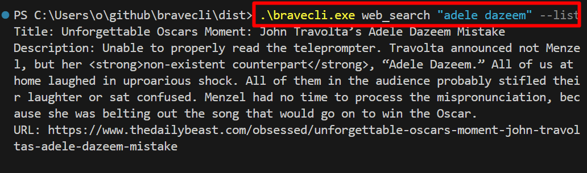
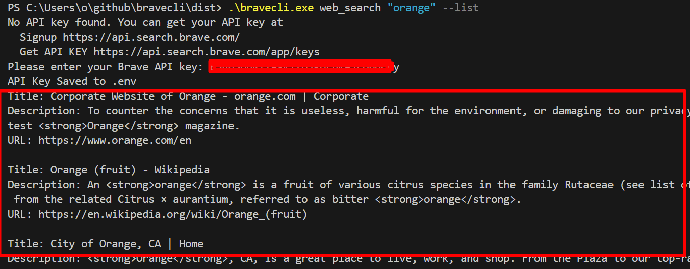

# bravecli

----

<h2 align="center">bravecli</h2>
<h4 align="center">A command-line interface for the Brave Search API. </h4>  
<p align="center">
  <a href="https://github.com/ellerbrock/open-source-badges/">
    
  </a>
  <a href="https://opensource.org/licenses/MIT">
    
  </a>
</p>


---

<p align="center">
  
</p>

---

# Summary
### -  *[Installation](#Installation)*
### -  *[Usage](#Usage)*
### -  *[Deveopment](#For-developers)*
### -  *[Contributors](#Contributors)*
### -  *[Links](#Links)*
### -  *[License](#License)*

 
# Installation
### WINDOWS
```bash
cd ~
git clone https://github.com/wisehackermonkey/bravecli.git
cd bravecli
python -m venv venv
venv/Scripts/activate
pip install -r requirements.txt
# if your installing for develompent 
pip install -r requirements_dev.txt

``` 


### screenshot

<p align="center">
  
</p>

# Usage
### Commands
```bash

# Only listing title, description, and url from results
python bravecli.py web_search "adele dazeem" --list

# Basic usage with only the required arguments RAW OUTPUT
python bravecli.py web_search "adele dazeem"


# Saving results to a file
python bravecli.py web_search "adele dazeem" --save output.json

# Turning off safe search
python bravecli.py web_search "xxx" --safesearchoff

# Turning off safe search and saving results to a file
python bravecli.py web_search "adele dazeem" --safesearchoff --save output.json

# Turning off safe search and only listing title, description, and url from results
python bravecli.py web_search "xxx" --safesearchoff --list

# Saving results to a file and only listing title, description, and url from results
python bravecli.py web_search "adele dazeem" --save output.json --list

# All options at once
python bravecli.py web_search "adele dazeem" --safesearchoff --save output.json --list

```

./bravecli.exe web_search "adele dazeem" --list | Select-Object -First 5
./bravecli.exe web_search "adele dazeem" | Select-Object -First 10
./bravecli.exe web_search "adele dazeem" --save output.json | Select-Object -First 10
./bravecli.exe web_search "xxx" --safesearchoff | Select-Object -First 10
./bravecli.exe web_search "adele dazeem" --safesearchoff --save output.json | Select-Object -First 10
./bravecli.exe web_search "xxx" --safesearchoff --list | Select-Object -First 10
./bravecli.exe web_search "adele dazeem" --save output.json --list | Select-Object -First 10
./bravecli.exe web_search "adele dazeem" --safesearchoff --save output.json --list | Select-Object -First 10


-----------------
# Development
### 
```bash
# Install development dependencies
pip install -r requirements_dev.txt

# Run tests
pytest 

# or run
pytest test_bravecli.py
# how to create exe
pyinstaller --onefile -i favicon.ico bravecli.py

```


 -----------------
# Contributors

[](https://github.com/wisehackermonkey/bravecli/graphs/contributors)

##### Made with [contributors-img](https://contrib.rocks).

-----------------


# License

#### MIT © wisehackermonkey


[](https://opensource.org/licenses/MIT)
```bash
by oran collins
github.com/wisehackermonkey
oranbusiness@gmail.com
20230601
```